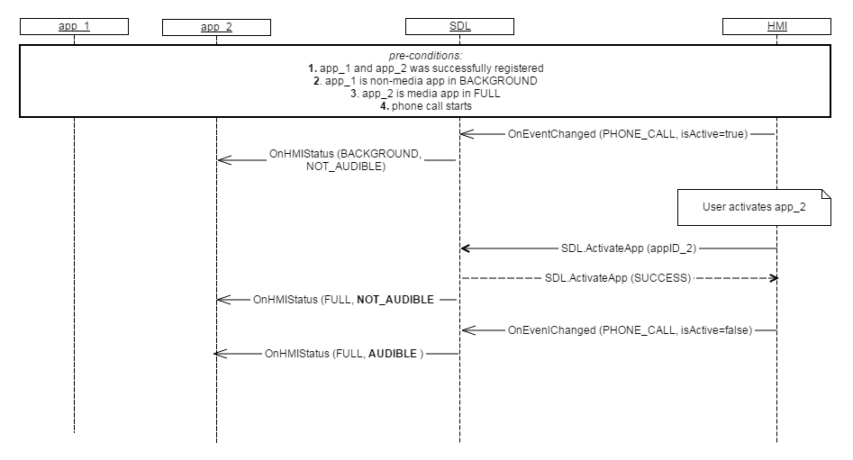
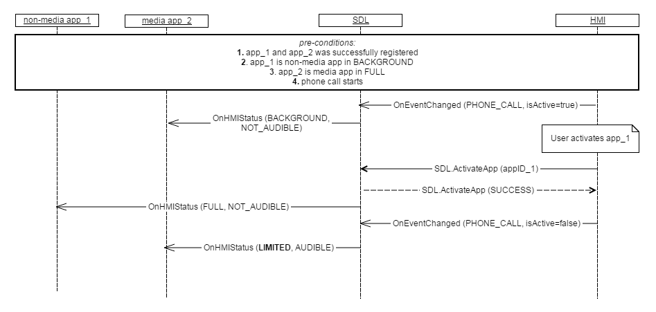
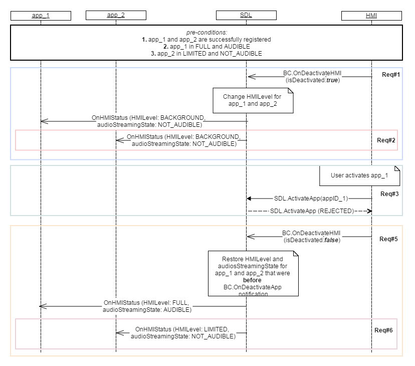
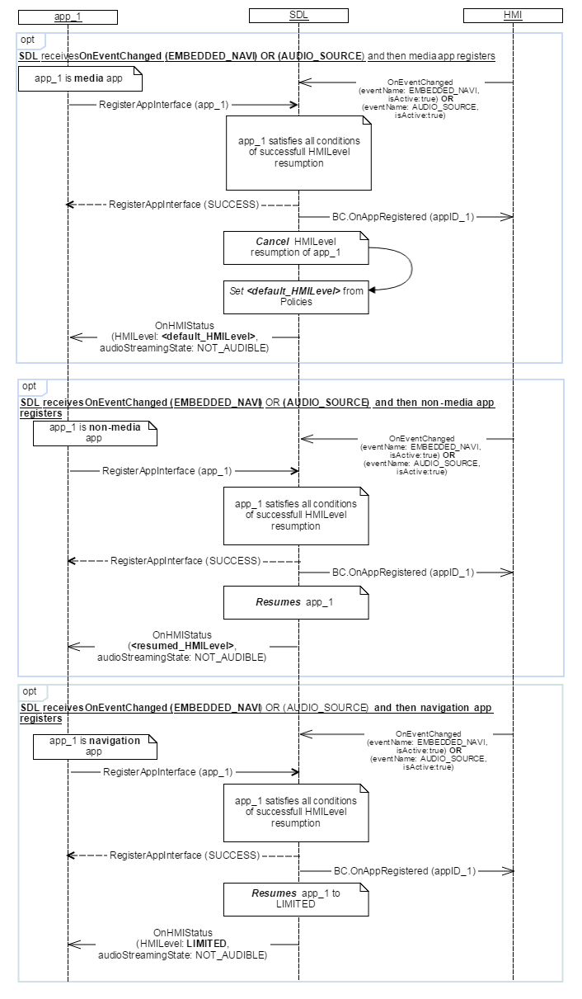
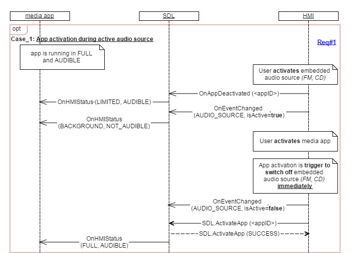
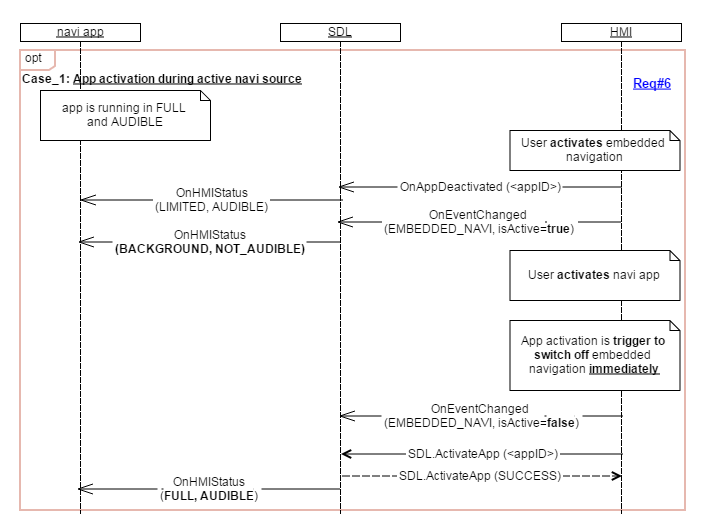

## OnEventChanged

Type
: Notification

Sender
: HMI

Purpose
: Notify SDL that an event becomes active

SDL uses `OnEventChanged` notification for correct changing HMILevels and AudioStreamingState of applications due to active events.

#### Phone call

!!! MUST

1.	Send notification with appropriate parameter value when active call on HMI has been started/ended.

2.	Send SDL OnAppDeactivated `<appID>` after the phone call started.

3.	Resume the applications to the previous-to-phone-call state on HMI (as SDL does not send BC.ActivateApp or BC.OnResumeAudioSource to HMI after the phone call is ended).
!!!

!!! NOTE
When SDL receives `OnEventChanged(PHONE_CALL, isActive: true)` from HMI, it changes the HMILevel of all applications currently either in FULL or LIMITED to BACKGROUND, audioStreamingState: NOT_AUDIBLE. 
After getting OnEventChanged(PHONE_CALL, isActive: false) from HMI, SDL returns applications to the previous-to-phonecall HMILevel. SDL does not send BC.ActivateApp or BC.OnResumeAudioSource to HMI after the phone call is ended.
!!!

**IMPORTANT NOTE**: SDL ignores all invalid notifications which come from HMI (invalid JSON, invalid data types/bounds etc.)

#### Emergency event

Safety Feature is HMI's specific mode when "Emergency event" or "Rear view camera" are active modes. The main idea from SDL<->HMI point of view is that navigation/audio streaming mustn’t interfere with Rear Camera View mode. HMI is responsible for managing audio/video data during "Emergency event"/"RearCamera" modes.

!!! MUST
1. 	Send notification with appropriate parameter value when mode "Emergency event"/"Rear view camera" becomes active or inactive.

_Note:_
When SDL receives `OnEventChanged(EMERGENCY_EVENT isActive:true)` notification about SafetyFeature activation from HMI, SDL moves all apps with AudioStreamingState AUDIBLE to NOT_AUDIBLE state and returns to previous state when gets  `OnEventChanged(EMERGENCY_EVENT isActive:false)`.
The app is not allowed to stream audio and it will not be heard by the user (due to other audio and/or system events blocking it).
!!!

#### Deactivate HMI

!!! MUST
1.	Send notification with appropriate parameter value when all apps to be inactivated/restored.
2.	Send `OnEventChange (DEACTIVATE_HMI isDeactivated: false)` before activating an app.

When SDL receives OnEventChange(DEACTIVATE_HMI isDeactivated: true) from HMI, it changes the HMILevel of all applications currently in FULL and-or LIMITED to BACKGROUND, audioStreamingState: NOT_AUDIBLE. After getting OnEventChange (DEACTIVATE_HMI isDeactivated: false) from HMI, SDL resumes the applications to the previous-to-event state on HMI.
!!!

**IMPORTANT NOTE**:  When applications are into BACKGROUND, NOT_AUDIBLE mode SDL **rejects** all app activation requests from HMI.

#### Audio source and Embedded navi

!!! MUST
1.	Send notification to SDL with appropriate parameter value when embedded navigation or audio source is activated/deactivated.
2.	Send SDL.ActivateApp (<appID_of_such_app>) in case of app activation or OnAppDeactivated (<appID>) in case of app deactivation.
3.	Switch off embedded source before app activation, when the type of activating app and embedded source are equal (the same)
 i.e. Media app activation is the trigger for HMI to switch off embedded audio source;
 navigation app activation is the trigger for HMI to switch off embedded navigation.
4.	When system supports audio mixing and embedded navigation starts streaming
    - Send SDL:TTS.Started to change media app currently in LIMITED and AUDIBLE due to active embedded navigation to LIMITED, ATTENUATED.
    - Send SDL:TTS.Stopped right after embedded navigation stops streaming to change application’s HMIStatus to the previous-to-event state.
!!!

!!! NOTE

- When app is successfully registered and SDL receives OnEventChanged(AUDIO_SOURCE, isActive:true) or OnEventChanged(EMBEDDED_NAVI, isActive:true), SDL changes HMILevel and AudioStreamingState of this application. (see the table _HMILevel and audioStreamingState of apps when embedded audio source or navigation was activated_) 

- When app is activated during active embedded navi or audio source SDL sets appropriate HMILevel and AudioStreamingState  (see the table _Apps activation during active embedded audio source or navigation_)

- If system supports audio mixing ("MixingAudioSupported" = true at .ini file) and navigation app in FULL or LIMITED and AUDIBLE and SDL receives OnEventChanged (AUDIO_SOURCE, isActive=true), SDL changes navigation app to (LIMITED, AUDIBLE)

- If system supports audio mixing ("MixingAudioSupported" = true at .ini file) and navigation app is in LIMITED and AUDIBLE due to active embedded audio source and SDL receives SDL.ActivateApp (<appID_of_navigation_app>), SDL changes navigation app to (FULL, AUDIBLE).

- If system supports audio mixing ("MixingAudioSupported" = true at .ini file) and embedded navigation starts streaming, SDL changes media app from LIMITED and AUDIBLE to LIMITED, ATTENUATED, after embedded navigation stops streaming SDL changes media app to LIMITED, AUDIBLE.

- When system supports audio mixing and three apps different types are running and user activates embedded audio source or embedded navigation, SDL changes HMILevel of applications.

!!!

#### HMILevel and audioStreamingState of apps when embedded audio source or navigation was activated
|appHMIType|HMILevel before embedded source activation|embedded source activation|HMILevel during active embedded source|
|:---|:---|:--------|:---------|
|media|FULL or LIMITED and AUDIBLE|embedded audio source|BACKGROUND and NOT_AUDIBLE|
|navigation|FULL or LIMITED and AUDIBLE|embedded audio source|LIMITED and AUDIBLE
|non-media|FULL or LIMITED and AUDIBLE|embedded audio source|BACKGROUND and NOT_AUDIBLE|
|media|FULL or LIMITED and AUDIBLE|embedded navigation|LIMITED and AUDIBLE|
|navigation|FULL or LIMITED and AUDIBLE|embedded navigation|BACKGROUND and NOT_AUDIBLE|
|non-media|FULL or LIMITED and AUDIBLE|embedded navigation|BACKGROUND and NOT_AUDIBLE|

#### Apps activation during active embedded audio source or navigation
|appHMIType|active embedded source|App activation|
|:---|:---|:--------|
|media|embedded audio source|FULL and AUDIBLE (embedded audio source should be switched off)|
|navigation|embedded audio source|FULL and AUDIBLE (embedded audio source still active)|
|non-media|embedded audio source|FULL and NOT_AUDIBLE (embedded audio source still active)|
|media|embedded navigation|FULL and AUDIBLE (embedded navigation is still active)|
|navigation|embedded navigation|FULL and AUDIBLE (embedded navigation should be switched off)|
|non-media|embedded navigation|FULL and NOT_AUDIBLE (embedded navigation still active)|

#### Parameters

|Name|Type|Mandatory|Additional|Description
|:---|:---|:--------|:--------|:---------|
|eventName|Common.EventTypes|true|-|Specifies the types of active events|
|isActive|Boolean|true|-|Must be 'true' - when the event is started on HMI. Must be 'false' when the event is ended on HMI|

#### CommonEventType
|Element name|Type|
|:---|:---------|
|PHONE_CALL|Phone call is active|
|EMERGENCY_EVENT|Active emergency event, active parking event|
|DEACTIVATE_HMI|GAL/DIO is active|
|AUDIO_SOURCE|Navigated to audio(radio, etc)|
|EMBEDDED_NAVI|Navigated to navigation screen|

### Sequence Diagrams
|||
PHONE_CALL

|||

|||
PHONE_CALL

|||

|||
EMERGENCY_EVENT

|||

|||
DEACTIVATE_HMI

|||

|||
EMBEDDED_NAVI or AUDIO_SOURCE

|||

|||
App activation during active embedded audio source

|||

|||
App activation during active embedded navigation

|||

|||
Correlation between audioStreamingState of media app and embedded navigation in case "MixingAudioSupported" = true/false

|||

|||
Multiple apps activation during active embedded navigation or audio source

|||

#### JSON Example Notification
```json
{
  "jsonrpc" : "2.0",
  "method" : "OnEventChanged",
  "params" :
  {
    "eventName" : "PHONE_CALL",
    "isActive" : true
  }

}
```