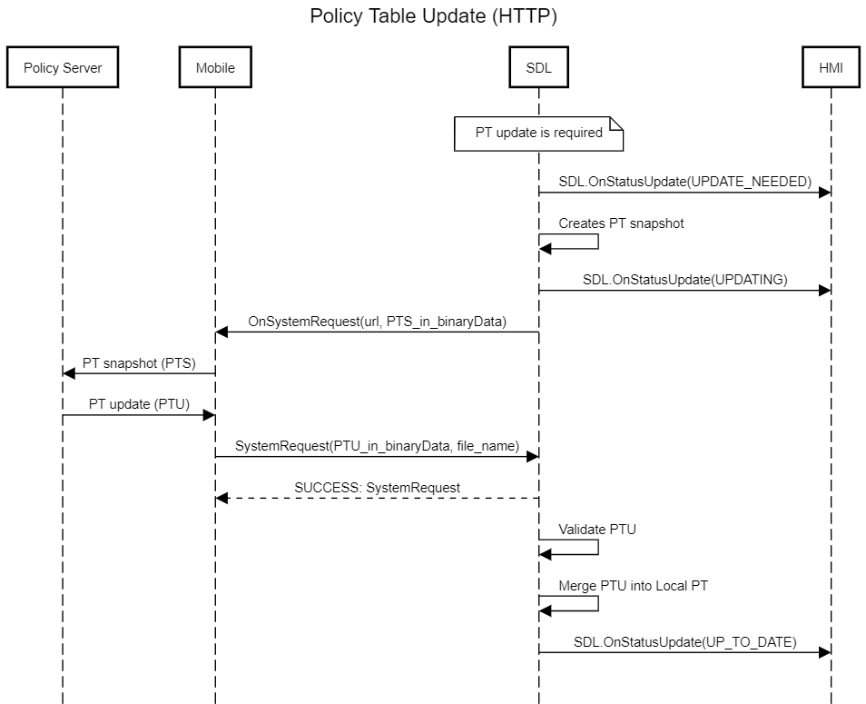

## PolicyUpdate
Type
: Function

Sender
: SDL

Purpose
: Inform HMI about the Policy Table Update (PTU) mechanism is triggered on SDL

In case SDL is built with **DEXTENDED_POLICY: HTTP" flag** SDL supports PolicyTableUpdate flow **without HMI-related logic**. 

### Request

``BC.PolicyUpdate`` represents SDL-generated request to start the PTU sequence.

!!! SDL must

* Send SDL.OnStatusUpdate(UPDATE_NEEDED) to HMI.
* Encrypt the PT Snapshot copying the Local Policy Table into Memory and remove "messages" sub-section from "consumer_friendly_messages" section.
*  Store PT snapshot in SDL memory.
*  Sends PT Snapshot to a random app as binary data. 
*  Define the URL(s) the PTS will be sent to. Policies manager must refer PTS "endpoints" section, key "0x07" for the appropriate `<app id>` which was chosen for PTS transferring.
* SDL defines the timeout to wait a response on PTU as a value of PTS "module_config" section, key `<timeout_after_x_seconds>`.
* Send PTU status notifications on ``SDL.OnStatusUpdate`` to HMI.

!!! note

1. ``BC.PolicyUpdate`` dependencies:
   * SDL sends ``BC.PolicyUpdate`` 
2. Triggers for sending ``BC.PolicyUpdate`` (whichever comes first):
   * Days since previous successful PTU (``"exchange_after_x_days"`` value in local PolicyTable (PT))
   * Kilometers since previous successful PTU (``"exchange_after_x_kilometers"`` value in local PT)
   * Ignition cycles since previous successful PTU (``"exchange_after_x_ignition_cycles"`` value in local PT)
   * Expired module's certificate (stored in ``"certificate"``field of local PT)
   * New application (that is, not-yet existing in local PT) registration
   * No certificate in PolicyTable (stored at `"module_config"` section at local PT)
3. Parameters values origin:
   * ``file`` - is the path to the Snapshot of local PolicyTable (Snapshot PT final destination is Policies Server)
   * ``timeout`` - value taken from ``"timeout_after_x_seconds"`` field of local PT
   * ``retry`` - array of values from ``"seconds_between_retries"`` field of local PT. SDL handles the PTU retry sequence (re-requesting update if fails to receive during timeout) by itself.

#### Parameters

|Name|Type|Mandatory|Additional|
|:---|:---|:--------|:---------|
|file|String|true|minlength: 1<br>maxlength: 255|
|timeout|Integer|true|minvalue: 0<br>maxvalue: 65535|
|retry|Integer|true|array: true<br>minsize: 1<br>maxsize: 5<br>minvalue: 0<br>maxvalue: 65535|


#### Parameters

This RPC has no additional parameter requirements

### Example Request

```json
{
	"id": 103,
	"jsonrpc": "2.0",
	"method": "BasicCommunication.PolicyUpdate",
	"params":
	{
		"file": " / tmp / fs / mp / SnapshotPT.json ",
		"timeout": 60,
		"retry": [1, 5, 25, 125, 625]
	}
}

```
### Example Response

```json
{
	"id": 103,
	"jsonrpc": "2.0",
	"result":
	{
		"code": 0,
		"method": "BasicCommunication.PolicyUpdate"
	}
}

```

### Example Error

```json
{
	"id": 103,
	"jsonrpc": "2.0",
	"error": {
		"code": 11,
		"message": "Snapshot PT file not found",
		"data":
		{
			"method": "BasicCommunication.PolicyUpdate"
		}
	}
}

```

### Sequence Diagrams

|||
BC.PolicyUpdate in "HTTP" Policy Table Update Flow

|||
