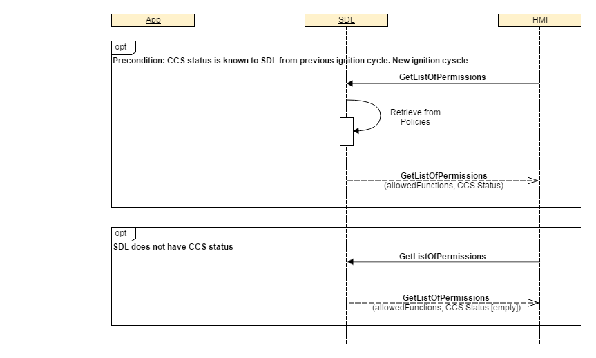
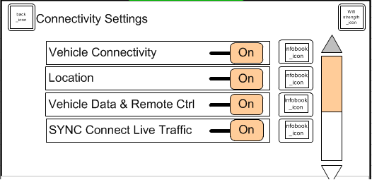

## GetListOfPermissions

Type
: Function

Sender
: HMI

Purpose
: Get the list of permissions for the specified application or for all applications.

### Request

!!! MUST  
1) Initiate sending `GetListOfPermissions` with “appID” parameter in the following cases:   
1.1) After receiving `SDL.ActivateApp{isPermissionsConsentNeeded: true}` from SDL.  

!!! NOTE
appID is known from the corresponding `SDL.ActivateApp` request.
!!!

1.2) After receiving `SDL.OnAppPermissionChanged{appID, appPermissionsConsentNeeded: true}` from SDL.  
1.3) After the User presses the button to change the permissions for the application.  
1.4) After ignition on to retrieve the "External UCS Status" setting stored on SDL.  

2) Initiate sending `GetListOfPermissions` without “appID” parameter in the following cases:  
2.1) After the User presses the button to change the permissions of all currently registered applications.  

!!! IMPORTANT  
When `GetListOfPermissions` is requested without “appID” parameter, the response of PermissionItem array contains the PermissionGroups (“name” parameters) for all the applications as a whole and “allowed” parameter is common for each group (e.g. if at least one of the applications has disallowed parameter for some group, “allowed” value returned for this group in the context of all application must be false). (_For more details see the diagram GetListOfPermissions without appID_). 
!!!

3) Store the pair of values id<->name of PermissionItem structure which were obtained via `GetListOfPermissions` response. These pairs will be used for future notifications via [OnAppPermissionConsent](https://github.com/smartdevicelink/sdl_hmi_integration_guidelines/blob/master/docs/SDL/OnAppPermissionConsent/index.md) in case user’s choice for the application to allow some functionality has been updated (_For more details see OnAppPermissionConsent (id<->name dependency_).  
4) Display the received “External UCS Status” in the appropriate UI screen (_For more details see the picture ExternalConsentStatus_).
!!!

!!! NOTE  
a) The information about the application (name, ID, etc.) is provided by SDL via either [BC.UpdateAppList](../../BasicCommunication/UpdateAppList/index.md) or [BC.OnAppRegistered](../../BasicCommunication/OnAppRegistered/index.md) RPCs.  
b) If HMI has never sent externalConsentStatus before (via [OnAppPermissionConsent](../OnAppPermissionConsent/index.md)), SDL will respond with empty array.  
c) User can go to settings on HMI and enable or disable "External UCS" for an "entity". HMI will notify SDL accordingly (see figure ExternalConsentStatus).  
d) The resulting allowance of functional grouping is informed by parameter “allowedFunctions” to HMI in accordinance with result of ExternalConsentStatus.
!!!

#### Parameters

|Name|Type|Mandatory|Additional|
|:---|:---|:--------|:---------|
|appID|Integer|false|If no app specified list of permissions for all apps|

### Response

#### Parameters

|Name|Type|Mandatory|Additional|
|:---|:---|:--------|:---------|
|allowedFunctions|[Common.PermissionItem]|true|array: true<br>minsize: 0<br>maxsize: 100|
|ExternalConsentStatus|[Common.ExternalConsentStatus]|true|array: true<br>minsize: 0<br>maxsize: 100|

[Common.PermissionItem]: ../../common/structs/#permissionitem
[Common.ExternalConsentStatus]: ../../common/structs/#externalconsentstatus

### Sequence Diagrams
|||
GetListOfPermissions

|||
|||
GetListOfPermissions without AppId

|||
|||
GetListOfPermissions provide  External UCS Status to HMI

|||
|||
Possible Layout - ExternalConsentStatus  

|||

### Example Request

```json
{
  "id" : 143,
  "jsonrpc" : "2.0",
  "method" : "SDL.GetListOfPermissions",
  "params" :
  {
    "appID" : 65596
  }
}
```
### Example Response

```json
{
  "id" : 143,
  "jsonrpc" : "2.0",
  "result" :
  {
    "allowedFunctions" :

[
      {
    "name" : "Location-1",
      "id":1234,
      "allowed":true
  },

     {
    "name" : "Notifications",
      "id":76876,
      "allowed":false
  },

    ]

    "code" : 0,
    "method" : "SDL.GetListOfPermissions"
  }
}
```

### Example Error

```json
{
  "id" : 143,
  "jsonrpc" : "2.0",
  "error" :
  {
    "code" : 15,
    "message" : " A command cannot be executed because there is NO specified         with appID application registered ",
    "data" :
    {
      "method" : "SDL.GetListOfPermissions"
    }
  }
}
```
